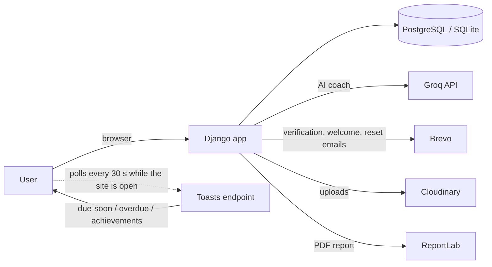
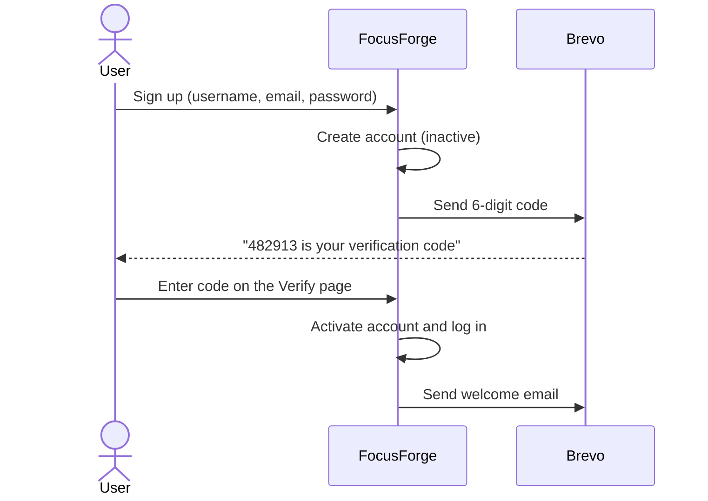

<div align="center">


<a href="https://github.com/Krishna5421/focusforge">
  
</a>

<p>
  
  
  
  
  <a href="https://focusforge-z9hy.onrender.com"></a>
</p>

**FocusForge** is an all-in-one productivity workspace: plan tasks with due times, build habits with streaks,
break goals into milestones, run Pomodoro and study sessions, and ask an AI coach what to do next.

<a href="https://focusforge-z9hy.onrender.com">
  
</a>

<sub>Hosted on Render's free tier: the first visit after a quiet period can take 30–50 seconds while the server wakes up.</sub>

</div>

---

## Table of contents

- [Why I built it](#why-i-built-it)
- [Features](#features)
- [Tech stack](#tech-stack)
- [How it works](#how-it-works)
- [Getting started](#getting-started)
- [Environment variables](#environment-variables)
- [Running tests](#running-tests)
- [Deployment on Render](#deployment-on-render)
- [REST API](#rest-api)
- [Project structure](#project-structure)

---

## Why I built it

My productivity was spread across too many apps: one for to-dos, another for habits, a timer for studying,
and notes for long-term goals. None of them talked to each other, so I never had one clear answer to the
question *"what should I work on right now?"*

FocusForge brings all of it into one place. Tasks, habits, goals, focus sessions, and study time share
the same data, so the dashboard, reminders, reports, and AI coach can see the whole picture. XP, streaks,
and achievements are there to make showing up every day feel rewarding, not like a chore.

---

## Features

| | Feature | What you get |
|---|---|---|
| ✅ | **Tasks** | Priorities, categories, tags, subtasks, repeating tasks, and an optional **due time**. Overdue tasks are highlighted, with filters for today, upcoming, and overdue. |
| ⏰ | **Smart reminders** | In-app pop-ups for tasks **due within the hour** and tasks that are **overdue**, plus a notification centre. |
| 🔁 | **Habits** | Daily habits, or weekly ones on chosen days, with current and longest streaks and a 7-day heatmap. |
| 🎯 | **Goals & milestones** | Deadlines, milestone checklists, and automatic progress percentages. |
| 🍅 | **Pomodoro focus** | A focus timer with a daily goal and a floating timer that keeps running while you move around the app. |
| 📚 | **Study sessions** | Timed sessions per subject, with file attachments and a study history. |
| 🏆 | **XP, levels & achievements** | 50+ achievements across focus, study, habits, tasks, and goals, with unlock pop-ups and progress for each one. |
| 🤖 | **AI assistant** | A FocusForge-focused coach (Groq) that reads your own tasks, habits, and goals. It answers general questions with "Add to FocusForge" suggestions and shows tables when they help. |
| 📊 | **Analytics & reports** | Dashboards and charts, plus a **weekly or monthly PDF report** with trends, an activity chart, habits, goals, and highlights. |
| 🔐 | **Accounts** | Sign in with **username or email**, **email verification** on sign-up, and password reset with 6-digit codes. |
| ✉️ | **Emails** | A branded HTML email with a plain-text version for verification, welcome, sign-in notices, password resets, and goal completions. |

---

## Tech stack

| Layer | Technology |
|---|---|
| Backend | Django 6, Django REST Framework, SimpleJWT, django-filter |
| Database | SQLite (local) · PostgreSQL via `DATABASE_URL` (production) |
| Frontend | Django templates, vanilla JavaScript, Bootstrap Icons, marked + DOMPurify for chat markdown |
| AI | Groq API (`openai/gpt-oss-20b`) |
| Email | Brevo transactional email API |
| Media & static | Cloudinary (uploads) · WhiteNoise (static files) |
| PDF | ReportLab |
| Hosting | Render (Gunicorn) |

---

## How it works



**Sign-up with email verification**



> Reminders run **while the user is on the site** instead of on a background scheduler, so they work on Render's free tier, where the service sleeps when idle.

---

## Getting started

### Prerequisites

- Python **3.12+** (developed on 3.14)
- Git

### 1. Clone and install

```bash
git clone https://github.com/Krishna5421/focusforge.git
cd focusforge

python -m venv venv
# Windows
venv\Scripts\activate
# macOS / Linux
source venv/bin/activate

pip install -r requirements.txt
```

### 2. Configure environment

```bash
cp .env.example .env
```

Fill in at least `SECRET_KEY`, `DEBUG=True`, and the Cloudinary keys. See [Environment variables](#environment-variables) below.

### 3. Set up the database and run

```bash
python manage.py migrate
python manage.py collectstatic --noinput
python manage.py createsuperuser   # optional, for /admin
python manage.py runserver
```

Open **http://127.0.0.1:8000**, create an account, and enter the emailed code.

> **Tip:** without Brevo keys, the verification email cannot be sent. For local testing, create a user with `createsuperuser`; those accounts are active straight away.

---

## Environment variables

| Variable | Required | Description |
|---|:---:|---|
| `SECRET_KEY` | ✅ | Django secret key. |
| `DEBUG` | | `True` for local development. Defaults to `False`. |
| `DATABASE_URL` | | PostgreSQL URL. SQLite is used when empty. |
| `ALLOWED_HOSTS` / `CSRF_TRUSTED_ORIGINS` | | Extra hosts and origins (comma-separated). The Render hostname is added automatically. |
| `CLOUDINARY_CLOUD_NAME` / `CLOUDINARY_API_KEY` / `CLOUDINARY_API_SECRET` | ✅ | Storage for profile pictures and study files. |
| `GROQ_API_KEY` | | Enables the AI assistant. |
| `BREVO_API_KEY` / `BREVO_SENDER_EMAIL` / `BREVO_SENDER_NAME` | ✅ for sign-up | Transactional email. Required for sign-up verification. |
| `SITE_URL` | | Base URL used in email links. Falls back to `https://$RENDER_EXTERNAL_HOSTNAME` on Render. |
| `SECURE_SSL_REDIRECT`, `SESSION_COOKIE_SECURE`, `CSRF_COOKIE_SECURE`, `SECURE_HSTS_SECONDS` | | Production security settings. |

> For better email deliverability, send from **your own domain** and authenticate it in Brevo (SPF and DKIM) instead of using a free mailbox address.

---

## Running tests

```bash
python manage.py test
```

The suite has **95+ tests** covering tasks, habits, goals, reminders, achievements, the assistant (with a mocked AI client), PDF export, login, and email verification. Tests **never send real emails**.

> Run `python manage.py collectstatic` first. The test run uses the compressed static manifest, so it fails if new static files have not been collected.

---

## Deployment on Render

1. Create a **PostgreSQL** database and a **Web Service** from this repository.
2. **Build command:** `./build.sh`. It installs requirements, runs `collectstatic`, and runs `migrate`.
3. **Start command:** `gunicorn focusforge.wsgi:application`
4. Add the [environment variables](#environment-variables). Render sets `RENDER_EXTERNAL_HOSTNAME` automatically, which also configures `ALLOWED_HOSTS`, CSRF, and email links.

---

## REST API

JWT-authenticated JSON API under `/api/`:

| Endpoint | Purpose |
|---|---|
| `POST /api/auth/register/` | Create an account (inactive until the email is verified) |
| `POST /api/auth/verify-email/` · `/verify-email/resend/` | Confirm the 6-digit code / request a new one |
| `POST /api/auth/login/` · `/login/refresh/` | Get or refresh JWT tokens (username **or** email) |
| `GET /api/auth/me/` · `/api/auth/profile/` | Current user and profile |
| `/api/tasks/`, `/api/habits/`, `/api/goals/`, `/api/study-sessions/`, `/api/pomodoro-sessions/`, … | CRUD for each module |
| `POST /api/assistant/ask/` | Ask the AI coach (50 messages per day) |

---

## Project structure

```
focusforge/
├── accounts/        # Auth, profile, email verification, PDF reports
├── achievements/    # XP, levels, achievement catalog and unlock logic
├── assistant/       # Groq-powered AI coach with output safety checks
├── core/            # Dashboard, analytics, deadlines, error pages
├── goals/           # Goals and milestones
├── habits/          # Habits, logs, and streaks
├── notifications/   # In-app notifications, toasts, email delivery
├── pomodoro/        # Focus timer and sessions
├── study/           # Subjects, study sessions, and files
├── tasks/           # Tasks, categories, tags, and due reminders
├── templates/       # Django templates, including HTML and plain-text emails
├── static/          # CSS, JavaScript, and images
├── focusforge/      # Settings and root URLs
└── build.sh         # Render build script
```

---

<div align="center">

Made with ☕ and focus by **[Krishna5421](https://github.com/Krishna5421)**


</div>
